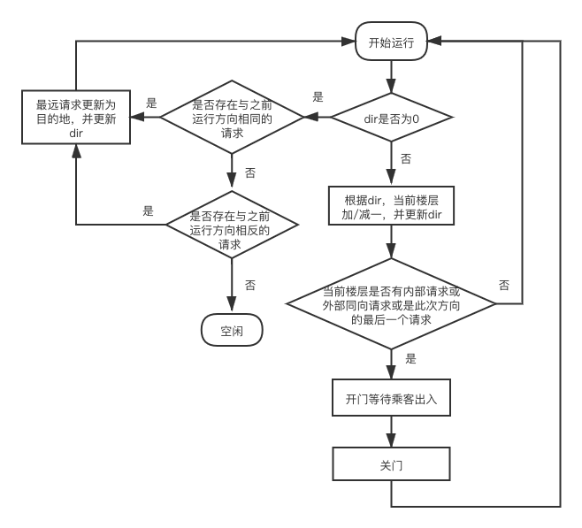
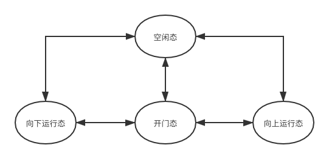
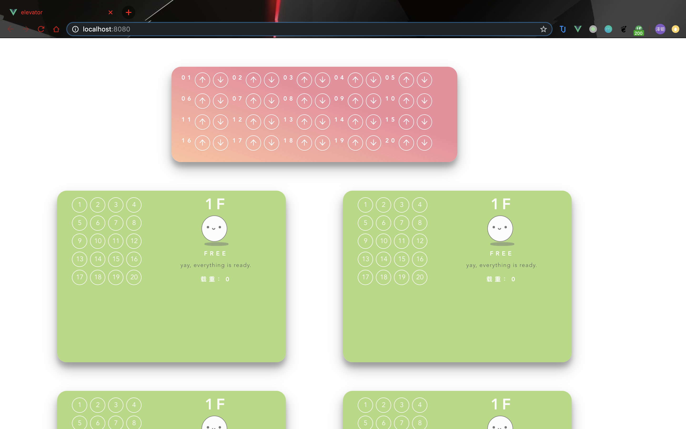
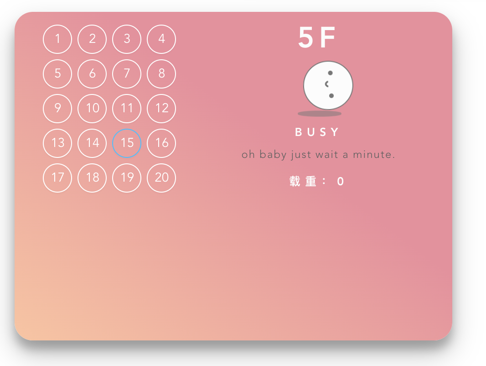
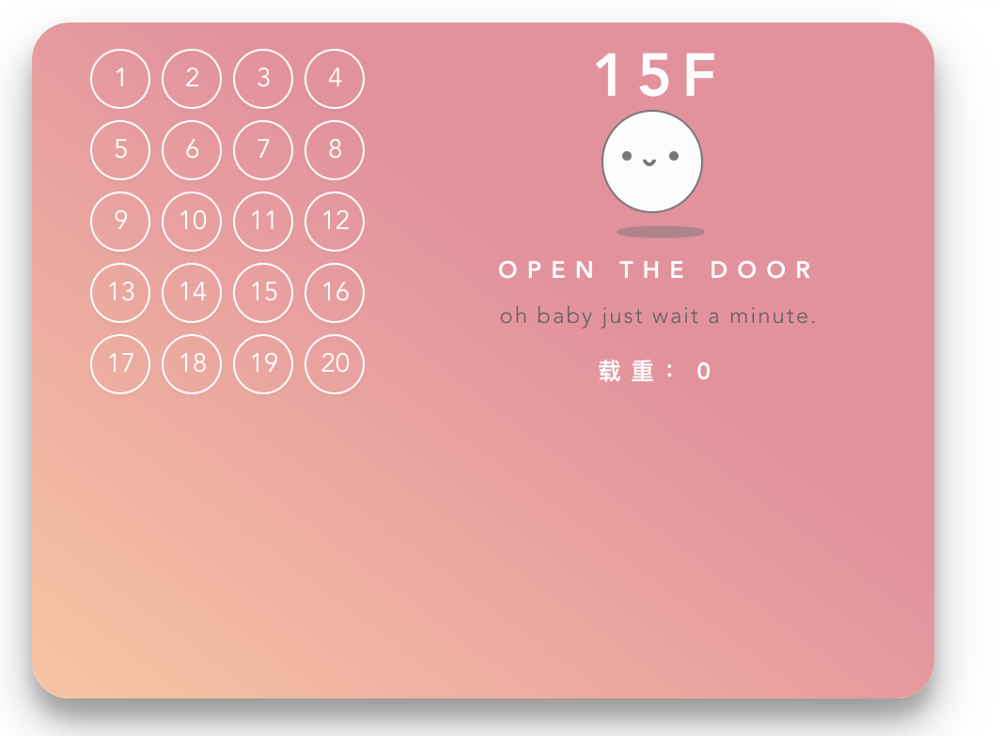
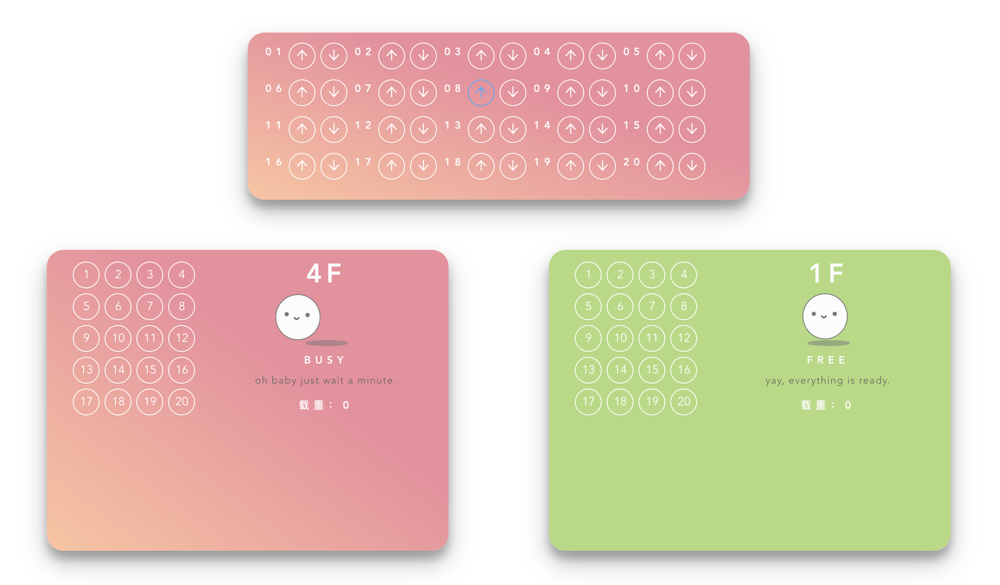
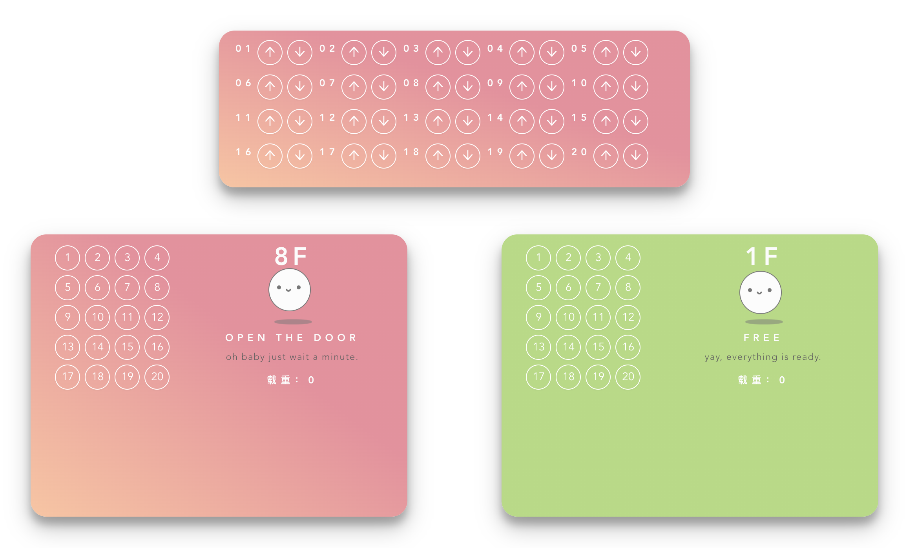

# 电梯调度 项目文档

> 题目：电梯调度
>
> 指导教师：张惠娟
>
> 姓名：王泽钜
>
> 学号：1751926

[TOC]

## 一、项目概述

​		本项目设计的是一个电梯调度系统。

​		在本项目实现的电梯调度系统中：共有5部电梯，楼层总共高度为20层，每层楼设有一个“向上”按钮和一个“向下”按钮。每一部电梯内设置有各楼层的数字键按钮，和报警键与通话键。

​		电梯调度算法支持多电梯独立运行，联合调度。对于每一个单独电梯采用SCAN扫描算法进行调度，对于楼层按钮产生的请求通过调度器联合调度电梯来响应任务，通过将任务根据算法计算分配给一个或几个电梯，从而使得在最短的时间内响应楼层请求。满足在任何一部电梯经过楼层时，如果电梯方向与此楼层请求方向同向时一定开门的基本实际需求。

​		为了有更清晰的可视化界面和更好的交互体验，选择采用以网页的方式呈现项目内容。项目支持通过点击楼层按钮或电梯内部按钮来模拟实际电梯中的功能，并通过通过UI的变化来展示电梯的具体调度过程。


## 二、电梯调度需求分析

### 1. 电梯的基本需求功能：

- 某一层楼20层，有五部互联的电梯。
- 每个电梯里面设置必要功能键：如数字键、关门键、开门键、报警键、当前电梯的楼层数、上升及下降状态等。
- 每层楼的每部电梯门口，应该有上行和下行按钮和当前电梯状态的数码显示器。
- 五部电梯门口的按钮是互联结的，即当一个电梯按钮按下去时，其他电梯的相应按钮也就同时点亮，表示也按下去了。
- 所有电梯初始状态都在第一层。每个电梯如果在它的上层或者下层没有相应请求情况下，则应该在原地保持不动。

### 2. 实际电梯的行为需求：

- 如果电梯方向与此楼层请求方向同向时一定会开门。
- 尽量使得乘客等待时间最少。
- 尽量使得电梯运行距离最短。
- 电梯中支持警报按钮，方便向相应的电梯负责人发送求救信号

## 三、项目解决方案

### 1. 单独电梯调度算法——LOOK算法：

​		对于每一台电梯都会收到来自内部按钮的请求和调度器分配的楼层按钮请求。

​		所以电梯需要一个算法来管理属于这部电梯的请求任务，计算运行路径。

- **LOOK算法原理：**

		> LOOK算法是扫描算法的一种改进。扫描算法(SCAN)是一种按照楼层顺序依次服务请求的算法，它让电梯在最底层和最顶层之间连续往返运行，在运行过程中响应处在于电梯运行方向相同的各楼层上的请求。扫描算法较好地解决了电梯移动的问题，在这个算法中，每个电梯响应乘客请求使乘客获得服务的次序是由其发出请求的乘客的位置与当前电梯位置之间的距离来决定的，所有的与电梯运行方向相同的乘客的请求在一次电梯向上运行或向下运行的过程中完成，免去了电梯频繁的来回移动

  > 对LOOK算法而言，电梯同样在最底层和最顶层之间运行。但当LOOK算法发现电梯所移动的方向上不再有请求时立即改变运行方向，而扫描算法则需要移动到最底层或者最顶层时才改变运行方向。

- **LOOK算法实现**

   - 设置一个定长布尔数组**isSelect**用来储存电梯内部按钮是否按下
   
   - 设置两个定长布尔数组**upList**和**downList**用存储楼层向上（下）按钮是否按下
   
   - 电梯的所有状态由两部分决定：**direction**和**doorState**。（**direction**是由**ctFloor**和**destination**两者比较决定的计算属性）
     	
      | direction | doorState | 电梯状态 |
      | ------ | ------ | ------ |
      | **1** | **0** | 电梯向上运动 |
      | **0** | **0** | 电梯停止，没有任务需要处理，为空闲状态 |
      | **-1** | **0** | 电梯向下运动 |
		| **0** | **1** | 电梯停止，正在开门等待乘客出入 |
     
   - 电梯每到一个楼层后，检测停靠开门条件是否满足。停靠条件为：
   
      1. **isSelect[ctFloor]**为**true**——即当前请求为内部请求
      2. **upList[ctFloor]**为**true**且**direction**为1（或**downList[ctFloor]**为**true**且**direction**为-1）——即当前请求为外部同方向请求
      3. **direction** 为0——即当前请求是此次方向最后一个任务。

  | 变量 | 类型 | 描述 |
  | ------ | ------ | ------ |
  | **doorState** | **Number** | 当前电梯是否开门 1:开门 0:关门 |
  | **ctFloor** | **Number** | 当前电梯所在楼层 |
  | **destination** | **Number** | 同方向的最远目标楼层 |
  | **isSelect** | **Array** | 内部按钮选择停靠的楼层 |
  | **upList** | **Array** | 电梯外部楼层向上按钮所等待的楼层 |
  | **downList** | **Array** | 电梯外部楼层向下按钮所等待的楼层 |
  | **direction** | **Number** | 电梯当前的方向 |
  | **oldDir** | **Number** | 电梯上一次的方向 |
  
  - **流程图：**
  
    

### 2. 联合电梯调度算法——抢占式+任务屏蔽：

​		对于每一个楼层的向上（下）按钮而言，外部请求不是对应于一个电梯，而是应该由调度器联合调度多个电梯来满足请求。

​		并且基于对生活中常见电梯的调研发现，为了使得乘客等待时间较少，同时让电梯的运行路径尽可能短，一般有两个原则：

   1. 电梯经过一个楼层时，如果此楼层的请求方向与此时电梯之前运行的方向相同，那么电梯一定会停靠开门，使此楼层乘客进入电梯。

   2. 当电梯全部空闲时，如果有一个楼层出现请求，那么应该只调动一台电梯进行响应。

      

- 算法策略：
  1. 调度器监听并存储20个楼层的上（下）按钮是否按下，如果按下则调度器先广播给所有运行中的电梯。
  2. 如果此时存在一台运行中的电梯可以顺路完成此次请求，则允许所有空闲状态电梯屏蔽此次请求。
  3. 如果不存在，那么在空闲状态电梯中选取一个接收此次请求，并允许其余空闲电梯屏蔽此次请求。
  4. 如果一台电梯已经在发出请求的楼层完成停靠后，调度器撤销其余电梯中这次响应。

- 电梯状态转换：

  
  ​	


## 四、项目操作说明

- 主界面：

  电梯的主界面被划分为六个面板。

  第一个面板为：楼层按钮面板——模拟电梯在各个楼层的按钮。

  其余五个面板：五个电梯模拟面板——每个面板模拟一个电梯，包括电梯内部的按钮，显示当前电梯运动状态，显示当前电梯所处楼层。



- 使用电梯内置按钮：

  - 按下电梯内部的按钮，电梯会此楼层添加到当前的任务队列，电梯依据算法逻辑可向目标楼层移动。

  - 此时电梯模拟面板由绿色变成红色——表示此时电梯状态从空闲状态切换到了运行状态
  - 电梯模拟面板中的文字内容也实时更新
  - 电梯模拟面板中的动画顶部实时显示当前电梯的所处楼层
    
  - 当电梯到达某一目标楼层时，电梯图文字更新为："OPEN THE DOOR"，表示此时电梯正在开门，等待乘客出入电梯。
  - 当电梯到达某一楼层并停靠开门时，电梯内部的按钮边框颜色从蓝色变成白色——表示此层停靠请求已经满足。
  - 团子表情的运动表现了当前电梯是移动(滚动)/停靠开门（上下弹跳）
    


- 使用楼层功能按钮
  - 按下楼层按钮面板中的按钮，调度算法会根据算法逻辑将这个请求通知部分电梯，电梯依据算法逻辑可向目标楼层移动。
    
  - 当电梯到达此楼层并停靠开门时，楼层按钮面板中选中的按钮边框颜色从蓝色变成白色——表示此层停靠请求已经满足。
    


## 五、总结

- 在实现电梯调度项目中运用了操作系统课程中所学的多线程并发技巧、进程状态转换、进程调度等知识。

### 1. 亮点：

- 精美的UI设计和交互体验。——好看的糖果色🍬
- 对于每个电梯遵守LOOK算法进行了优化了电梯处理任务的方式。
- 多电梯之间采用联合调度方法，权衡了乘客耗费时间最少和电梯运行成本（距离）最少。同时保证了电梯经过一个楼层时，如果此楼层的请求方向与此时电梯之前运行的方向相同，那么电梯一定会停靠开门，给等待的乘客更好的使用体验。

### 2. 展望：

- 在电梯群控算法中，存在两个优化目标：1.乘客耗费时间最少 2. 电梯运行成本（距离）最少。基于这两个目标有很多优秀的算法成果，本项目只是采用了较为基础的一个调度算法。基于特定的时间段乘坐电梯的特征以及具体数据分布情况，还有非常大的优化空间。

- 暂时没有考虑电梯的载荷问题。

## 六、项目部署与demo展示

### 1.demo网址：

https://major-333.github.io/index.html

可以直接访问并进行操作，不需下载和环境依赖。

推荐使用谷歌浏览器，只支持电脑屏幕尺寸的访问。

### 2. 仓库地址：

https://github.com/Major-333/OS_course_project

### 3. 开发工具：

#### 1. 开发环境：

- MacOS
- WebsStorm
- Chrome 

#### 2. 开发语言：

- JavaScript

#### 3. 开发框架：

- Vue.js

## 七、通过源码重新构建

```
npm install
```

### Compiles and hot-reloads for development
```
npm run serve
```

### Compiles and minifies for production
```
npm run build
```

### Lints and fixes files
```
npm run lint
```

### Customize configuration
See [Configuration Reference](https://cli.vuejs.org/config/).
